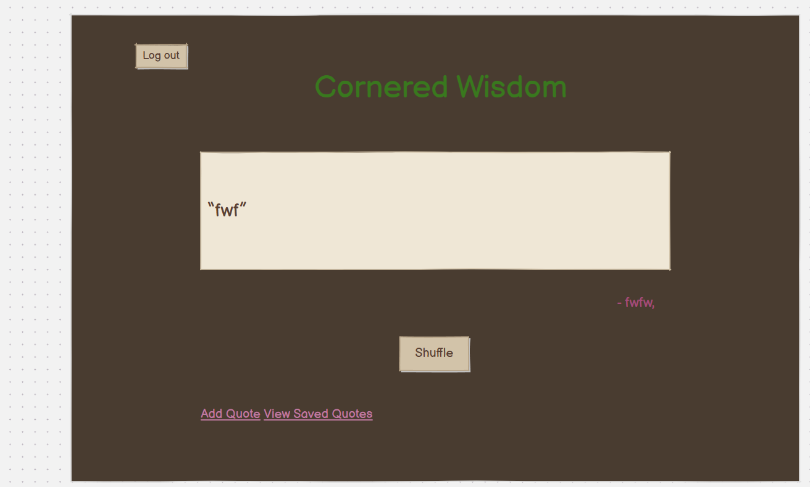
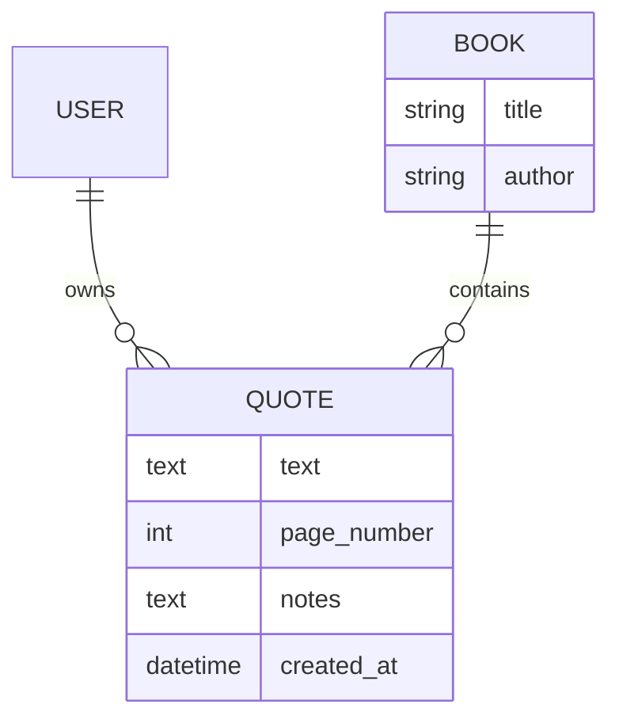

# Cornered Wisdom

Developer: Nasim Orion
([nasim-orion](https://www.github.com/nasim-orion))

[](https://www.github.com/nasim-orion/cornered_wisdom/commits/main)
[](https://www.github.com/nasim-orion/cornered_wisdom/commits/main)
[](https://www.github.com/nasim-orion/cornered_wisdom)
[](https://cornered-wisdom-0c18133950ec.herokuapp.com)

Cornered Wisdom is a personal quote collection application designed for
readers who want to save meaningful passages from books and return to
them later. Instead of quotes becoming lost in notebooks, photographs,
highlights or forgotten pages, the application gives each user one
private place to record a quote together with its source and their own
thoughts.

The application allows registered users to save the quote text, book
title, author, page number and personal notes. Saved quotes can be
viewed as a collection, sorted in several ways, edited, deleted, or
rediscovered using the shuffle feature. The aim is to make revisiting
collected ideas as important and revelatory as collecting them in the first place.

I chose this project because I wanted to create a practical application personal to me that I myself have wanted to see built and developed, albeit I would much have preferred this to be a mobile app with image scanning capabilities but that is beyond the scope of this project. This website is built
around the experience of reading and preserving useful ideas. The
concept of a personal "house of wisdom"  shaped both the functionality
and the visual identity of the project. The interface therefore uses an
old-book/manuscript aesthetic, with parchment textures, floral
borders and classical architectural imagery, rather than a conventional
modern dashboard. This was done to bring to the user's mind images of antiquity.


## UX

### The 5 Planes of UX

#### 1. Strategy

**Purpose**

-   Give readers a dedicated place to preserve memorable quotations from
    books.
-   Allow users to record useful context such as the book, author, page
    number and personal notes.
-   Encourage users to revisit previously saved material rather than
    simply accumulating it.
-   Keep each registered user's collection separate and personal.

**Primary User Needs**

-   Visitors need to understand quickly what Cornered Wisdom does before
    creating an account.
-   Users need a straightforward way to register, log in and log out.
-   Authenticated users need to create, view, edit and delete their own
    quotes.
-   Users need to find and organise saved material without unnecessary
    complexity.
-   Users need a simple way to rediscover quotes they may not otherwise
    revisit.
-   The interface should remain usable across desktop, tablet and mobile
    screen sizes.

**Project Goals**

-   Deliver a complete CRUD application using Django.
-   Provide secure user-specific access to saved quotes.
-   Keep the interface simple enough that saving a quote does not
    interrupt the reading experience.
-   Create a distinctive visual identity appropriate to books, reading
    and collected wisdom.
-   Deploy a working production version of the application.

#### 2. Scope

This release focuses on the core quote-collection workflow rather
than social or community functionality. Hence the exclusion of a user profile or share links etc.

**Content and Functional Requirements**

-   Public landing page explaining the application.
-   User registration, login and logout.
-   Add a quote.
-   Store book title and optional author.
-   Store an optional page number and personal notes.
-   View only the currently authenticated user's saved quotes.
-   Edit an existing quote.
-   Delete an existing quote after confirmation.
-   Sort saved quotes by newest, oldest, book or author.
-   Display a random saved quote on the home page.
-   Shuffle to another quote without reloading the full page.
-   Shuffle to another quote without landing on the same quote that was already displayed.
-   Server-side validation for required fields and page numbers.
-   Responsive layouts for desktop, tablet and mobile devices.

#### 3. Structure

**Information Architecture**

The application is deliberately small. Guests arrive at the landing page
and can either create an account or log in. Authenticated users arrive
at the home page, where a saved quote is presented. From
there they can add a quote, view their saved collection, shuffle the
displayed quote, or log out.

The saved-quotes page acts as the main management area. From it, users
can sort their collection and access edit or delete actions for
individual quotes.

**User Flow**

1.  A guest visits the landing page and learns what Cornered Wisdom
    offers.
2.  The guest registers for an account or logs in to an existing
    account.
3.  The authenticated user reaches the home page and sees one of their
    saved quotes.
4.  The user can add a new quote with its source information and notes.
5.  The user can open the section called **My Quotes** to browse and sort their collection.
6.  From the collection, the user can edit or delete one of their own
    quotes.
7.  The user can return home and use **Shuffle** to rediscover another
    saved quote.
8.  The user can log out when finished.

#### 4. Skeleton

Wireframes are documented in the [Wireframes](#wireframes) section of documentation. The
interface was designed around a narrow central reading area so that
quote text remains the visual focus. Forms use simple vertical layouts
and the main actions are intentionally limited.

#### 5. Surface

The final visual design takes inspiration from old books, manuscripts
and classical architecture. The authenticated pages use parchment
textures with a floral, old fashioned book border. The landing page is presented
more like a book cover, establishing the visual theme before the user
enters the application(and "opens the book").

### Colour Scheme

Cornered Wisdom uses a restrained palette based on parchment/velum, leather,
dark brown ink and gold.

-   `#3b2a1e` --- dark brown base/background.
-   `#333333` --- primary dark text.
-   `#4a3020` --- primary link colour.
-   `#6b4b32` / `#5a422f` --- borders and secondary brown details.
-   `#cc6505` --- warm orange-brown hover accent.
-   `#413226` --- notes and secondary text.
-   `#d4ad68` --- gold decorative accent used on the book-cover design.

The palette was chosen to support the old-book aesthetic while retaining
sufficient contrast between text, controls and parchment backgrounds.

### Typography

The site primarily uses **Georgia**, a serif typeface chosen because its
traditional letterforms complement the book/manuscript design and remain
readable for longer quotations. Headings also use **Garamond** with
`"Times New Roman"` as a fallback where appropriate. These fonts present class without being gaudy and offensive to the modern readers palate.

The project does not depend on an external icon library for its main
interface. The classical temple/book logo and favicon generated by ChatGPT form the main
visual branding.

## Wireframes

Wireframes were created using Balsamiq to plan the structure and layout of the application.

### Landing Page


### Home Page



### My Quotes


### Add Quote 


### Edit Quote 


### Delete Quote 


## User Stories

  -----------------------------------------------------------------------
  Target                  Expectation             Outcome
  ----------------------- ----------------------- -----------------------
  As a guest user         I would like to         so that I can decide
                          understand the purpose  whether I want to
                          of the application      create an account.

  As a guest user         I would like to         so that I can create my
                          register                own quote collection.

  As a registered user    I would like to log in  so that I can access my
                                                  saved quotes.

  As a registered user    I would like to log out so that I can end my
                                                  authenticated session.

  As a registered user    I would like to add a   so that I can preserve
                          quote                   a passage I want to
                                                  remember.

  As a registered user    I would like to record  so that I remember
                          the book title and      where a quote came
                          author                  from.

  As a registered user    I would like to record  so that I can find the
                          an optional page number passage again in the
                                                  book.

  As a registered user    I would like to add     so that I can preserve
                          personal notes          my own thoughts about a
                                                  quote.

  As a registered user    I would like to view    so that I can revisit
                          all of my saved quotes  my collection.

  As a registered user    I would like to sort my so that I can browse
                          quotes                  the collection in a
                                                  useful order.

  As a registered user    I would like to edit a  so that I can correct
                          saved quote             mistakes or update its
                                                  information.

  As a registered user    I would like to delete  so that I can remove
                          a quote                 material I no longer
                                                  want to keep.

  As a registered user    I would like to shuffle so that I can
                          my saved quotes         rediscover material I
                                                  may have forgotten.

  As a registered user    I would like my quotes  so that my collection
                          to remain separate from remains personal.
                          other users' quotes     

  As a user               I would like the site   so that I can use it on
                          to work on different    desktop, tablet or
                          screen sizes            mobile.
  -----------------------------------------------------------------------

## Features

### Existing Features

  -------------------------------------------------------------------------------------------
  Feature                 Notes                   Suggested Screenshot
  ----------------------- ----------------------- -------------------------------------------
  Landing Page            Introduces Cornered     `documentation/features/landing.png`
                          Wisdom to               
                          unauthenticated         
                          visitors and provides   
                          clear registration and  
                          login actions.          

  Register                Uses Django's           `documentation/features/register.png`
                          authentication system   
                          and `UserCreationForm`  
                          to create accounts.     

  Login                   Allows existing users   `documentation/features/login.png`
                          to authenticate using   
                          Django's built-in       
                          authentication views.   

  Logout                  Provides a POST-based   `documentation/features/logout.png`
                          logout action protected 
                          with CSRF tokens.              

  Home / Featured Quote   Shows a quote from the  `documentation/features/home.png`
                          logged-in user's own    
                          collection as the       
                          central focus of the    
                          page.                   

  Shuffle Quote           Uses JavaScript to `documentation/features/shuffle.png`
                          request another quote   
                          without a full-page     
                          refresh and avoids      
                          repeating the current   
                          quote where possible.   

  Add Quote               Allows users to save    `documentation/features/add-quote.png`
                          quote text, book title, 
                          optional author,        
                          optional page number    
                          and notes.              

  My Quotes               Displays the            `documentation/features/my-quotes.png`
                          authenticated user's    
                          saved quote collection. 

  Sorting                 Quotes can be ordered   `documentation/features/sorting.png`
                          by newest, oldest, book 
                          or author.              

  Edit Quote              Allows users to update  `documentation/features/edit-quote.png`
                          one of their existing   
                          quotes and its          
                          associated information. 

  Delete Quote            Provides a confirmation `documentation/features/delete-quote.png`
                          page before a quote is  
                          permanently deleted.    

  Validation              Quote text and book     `documentation/features/validation.png`
                          title are required;     
                          page number is optional 
                          but must be 1 or        
                          greater when supplied.
                          This applies to quote creation
                           and editing 

  User-specific Data      Quote queries are       `documentation/features/my-quotes.png`
                          filtered by the         
                          logged-in user so users 
                          work with their own     
                          collections.            

  Responsive Design       Media queries adapt the `documentation/features/responsive.png`
                          manuscript/book layout  
                          for desktop, tablet and 
                          mobile screens.         

  Favicon / Branding      A classical temple and  `documentation/features/favicon.png`
                          open-book emblem is     
                          used for the logo and   
                          favicon.                

  Heroku Deployment       The production          `documentation/features/heroku.png`
                          application is deployed 
                          and accessible through  
                          Heroku.                 
  -------------------------------------------------------------------------------------------

### Future Features

-   **Search** --- search saved quotes by quotation text, book or
    author.

-   **OCR Quote Capture** --- photograph a page and extract quote text
    to reduce manual typing.
-   **Mobile Application** --- provide a dedicated mobile experience.
-   **Home-screen Widget** --- surface a saved quote periodically 
    that can also be shuffled with a toggle
    without requiring the user to open the application.
-   **Favourite Quotes** --- mark particularly important quotations for
    quicker access.
-   **Improved Filtering** --- combine sorting with filters for books,
    authors or tags.
-   **Additional Accessibility Testing** --- continue refining contrast,
    keyboard navigation and responsive behaviour.

## Tools & Technologies

  -----------------------------------------------------------------------
  Tool / Technology                   Use
  ----------------------------------- -----------------------------------
  Git                                 Version control throughout
                                      development.

  GitHub                              Remote repository, commit history
                                      and project management.

  VS Code                             Local development environment.

  HTML                                Page structure and Django
                                      templates.

  CSS                                 Old-book visual design, forms and
                                      responsive layouts.

  JavaScript                          Asynchronous quote shuffle
                                      functionality.

  Python                              Back-end programming language.

  Django                              Main web framework, ORM, templates
                                      and authentication.

  SQLite                              Local development database.

  PostgreSQL                          Production relational database.

  Heroku                              Hosting and automatic deployment.

  Gunicorn                            Production WSGI server.

  WhiteNoise                          Serving static files in the
                                      deployed application.

  dj-database-url                     Database configuration using the
                                      `DATABASE_URL` environment
                                      variable.

  GitHub Copilot                      Development assistance and code
                                      suggestions.

  ChatGPT                             Development assistance, 
                                            image generation

                                        debugging,
                                      explanations and design iteration.
 
   Balsamiq                      wireframes.

    https://randomkeygen.com/                             Secret key generation.


  -----------------------------------------------------------------------


## Database Design

### Data Model

Cornered Wisdom uses Django's built-in `User` model together with two
application models: `Book` and `Quote`.

-   A **User** can numerous quotes.
-   A **Book** can have many quotes.
-   Each **Quote** belongs to one user and one book.
-   Deleting a user deletes that user's quotes through `CASCADE`.
-   Deleting a book deletes quotes related to that book through
    `CASCADE`.



### Model Fields

**Book**

-   `title` --- `CharField(max_length=255)`.
-   `author` --- `CharField(max_length=255, blank=True)`; author is
    intentionally optional.

**Quote**

-   `user` --- foreign key to Django's `User`.
-   `book` --- foreign key to `Book`, with `related_name="quotes"`.
-   `text` --- quote content.
-   `page_number` --- optional positive integer.
-   `notes` --- optional text.
-   `created_at` --- automatically records when the quote was created.

## Agile Development Process

### GitHub Projects and Issues

GitHub was used alongside Git for iterative development. Features were
implemented incrementally, tested, committed and pushed throughout the
project. Development was organised around user-facing functionality such
as authentication, quote CRUD operations, sorting, shuffle behaviour,
deployment and styling.

GitHub Issues and a project board were used during development,
screenshots are stored in `documentation/`  as evidence
of the planning process.

### MoSCoW Prioritisation

MoSCoW prioritisation helped separate essential functionality from
enhancements.

**Must Have**

-   User registration, login and logout.
-   Create quotes.
-   Read/view saved quotes.
-   Edit quotes.
-   Delete quotes.
-   User-specific quote ownership and access.
-   Required-field and page-number validation.
-   A deployed working application.

**Should Have**

-   Random quote display.
-   Shuffle functionality.
-   Responsive styling.
-   Clear landing page and consistent visual identity.

**Could Have**

-   Sorting by newest, oldest, book and author.
-   Additional visual polish and decorative branding.

**Won't Have in this iteration**

-   OCR photo-to-text quote capture.
-   Dedicated mobile application.
-   Mobile/home-screen quote widget.
-   Advanced search, filtering and tagging.
-   User profiles.
## Testing

Full manual and validation testing is documented separately in
[TESTING.md](TESTING.md).

Testing during development covered authentication, CRUD operations,
user-specific data access, validation, sorting, asynchronous shuffle
behaviour, static files, deployment and responsive layouts. The deployed
application was also inspected using browser device emulation across
phone and tablet viewport sizes.

## Deployment

The live application is deployed on Heroku:

https://cornered-wisdom-0c18133950ec.herokuapp.com/

### Heroku Deployment

The application uses a `Procfile` containing:

``` text
web: gunicorn cornered_wisdom.wsgi
```

The project also includes `requirements.txt` and `.python-version` for
the deployment environment.

The production database is configured from the `DATABASE_URL`
environment variable using `dj-database-url`. The Django `SECRET_KEY` is
stored as an environment/config variable rather than committed to the
repository.

Static files are served using WhiteNoise. `collectstatic` is run for
deployment and generated `staticfiles/` output is not committed to
source control.

The project is connected to GitHub for automatic Heroku deployment,
allowing updates pushed to the deployment branch to be built and
released automatically.

### Environment Variables

Any developer cloning the project should create their own local
environment configuration and must not commit secret values.

Example:

``` python
import os

os.environ.setdefault("SECRET_KEY", "your-own-secret-key")
os.environ.setdefault("DATABASE_URL", "your-own-database-url")
```

### Local Development

Clone the repository:

``` bash
git clone https://www.github.com/nasim-orion/cornered_wisdom.git
cd cornered_wisdom
```

Create and activate a virtual environment, then install the
dependencies:

``` bash
pip install -r requirements.txt
```

Apply migrations:

``` bash
python manage.py migrate
```

Run the development server:

``` bash
python manage.py runserver
```

The local development server will normally be available at
`http://127.0.0.1:8000/`.

### Local vs Deployment

The same core application and interface are used locally and on Heroku.
During development, deployment-specific issues included configuring the
correctly named `Procfile`, enabling the web process, configuring
WhiteNoise/static files and ensuring environment-based database settings
were used. These were resolved with the use of AI so that the deployed application now
reflects the intended project functionality.

## Credits

### Content and Development Resources

  -----------------------------------------------------------------------
  Source                              Notes
  ----------------------------------- -----------------------------------
  Django Documentation                Reference for Django framework
                                      behaviour, authentication, models,
                                      views and templates.

  WhiteNoise Documentation            Guidance for serving static files
                                      in production.

  Heroku Documentation                Deployment and application
                                      configuration.

  GitHub                              Source control and repository
                                      hosting.

  ChatGPT                             Assistance with code explanations,
                                      debugging, responsive CSS, project
                                      documentation and design iteration.

  GitHub Copilot                      Code suggestions during
                                      development.
  -----------------------------------------------------------------------

### Media

The project's principal visual assets --- including the parchment/book
backgrounds, classical temple/open-book branding and favicon artwork ---
were generated with OpenAI image-generation assistance specifically for
Cornered Wisdom.

The project uses these images from `home/static/home/images/`:

-   `body-image.png` --- parchment/book background with floral
    border.
-   `landing.png` --- leather book-cover background for the public
    landing page.
-   `logo.png` --- classical temple/open-book logo used within the
    application.
-   `favicon.png` --- simplified favicon version of the branding.
-   `paper-texture.png` --- parchment texture.
-   `quote-paper-texture.png` --- lighter texture used behind displayed
    quotes.

If any additional third-party images are added before submission, their
original source and usage should also be credited here.

### Acknowledgements

I would like to thank the staff at Code institute for their time and learning resources that supported
me during the development of Cornered Wisdom, particularly those who
provided guidance, debugging support and feedback while I developed my
understanding of Django and full-stack web development. I would also like to thank the rest of the members of the cohort for helping with debugging and providing moral support.


#### Cloning

You can clone the repository by following these steps:

1. Go to the [GitHub repository](https://www.github.com/nasim-orion/cornered_wisdom).
2. Locate and click on the green "Code" button at the very top, above the commits and files.
3. Select whether you prefer to clone using "HTTPS", "SSH", or "GitHub CLI", and click the "copy" button to copy the URL to your clipboard.
4. Open "Git Bash" or "Terminal".
5. Change the current working directory to the location where you want the cloned directory.
6. In your IDE Terminal, type the following command to clone the repository:
	- `git clone https://www.github.com/nasim-orion/cornered_wisdom.git`
7. Press "Enter" to create your local clone.

Alternatively, if using Ona (formerly Gitpod), you can click below to create your own workspace using this repository.

[](https://gitpod.io/#https://www.github.com/nasim-orion/cornered_wisdom)

**Please Note**: in order to directly open the project in Ona (Gitpod), you should have the browser extension installed. A tutorial on how to do that can be found [here](https://www.gitpod.io/docs/configure/user-settings/browser-extension).

#### Forking

By forking the GitHub Repository, you make a copy of the original repository on our GitHub account to view and/or make changes without affecting the original owner's repository. You can fork this repository by using the following steps:

1. Log in to GitHub and locate the [GitHub Repository](https://www.github.com/nasim-orion/cornered_wisdom).
2. At the top of the Repository, just below the "Settings" button on the menu, locate and click the "Fork" Button.
3. Once clicked, you should now have a copy of the original repository in your own GitHub account!

### Local VS Deployment


- There are no  major differences between the local version when compared to the deployed version online.


 ### END 

- I would like to give special thanks to my Code Institute masterclass coach, [Tim Nelson](https://www.github.com/TravelTimN), as well as cohort facilitator Marko for the support and understanding throughout the development of this project.


